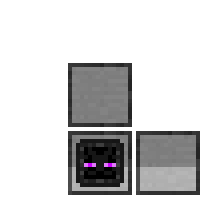

# Creative Narrator



An indestructible version of the Narrator block, available only in Creative mode. Adds a global broadcast method.

- **Registry name:** `linguaperipherals:creative_narrator`
- **Peripheral type:** `creative_narrator`
- **Hardness:** -1.0 (indestructible in Survival)
- **Wrench:** Creative mode only — Right-click to rotate
- **Recipe:** Not craftable

## Peripheral Methods

The Creative Narrator inherits all methods from the [Narrator](narrator.md), plus:

### globalVoice(text)

Plays the voice message to **all players across all dimensions**, ignoring distance.

**Parameters:**
- `text` (string) — The text to speak.

**Returns:** `true` if the voice was sent successfully.

**Example:**
```lua
local n = peripheral.find("creative_narrator")
n.globalVoice("Server shutdown in 5 minutes!")
```